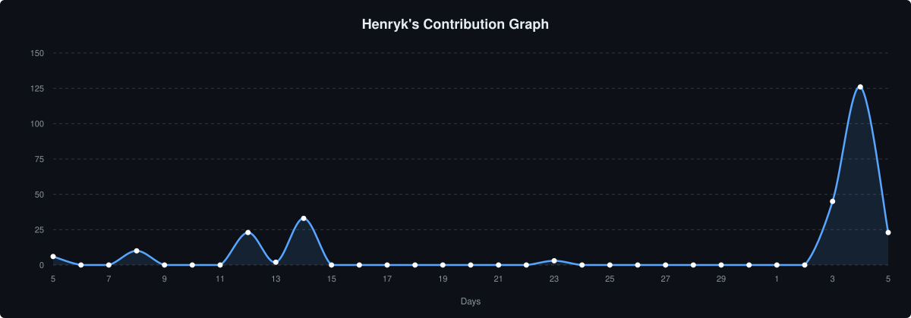

  

### about

16-year-old software engineer, systems builder & ml enthusiast. founder of headcanon. building high-performance systems, visual ai tooling, and developer infrastructure.

🌐 [portfolio](https://YOUR-PORTFOLIO-URL.com) &nbsp;·&nbsp; ✉️ [henrykgreysson78@gmail.com](mailto:henrykgreysson78@gmail.com) &nbsp;·&nbsp; 📍 Melbourne

### core skills

  

- **languages:** typescript · javascript · python · c# · c · sql
- **web & apps:** React · Next.js · Node.js · REST APIs · Vite
- **backend & data:** Supabase · PostgreSQL · Stripe · GitHub API
- **ai & ml:** LLM agents · AI-powered apps · Jupyter · Kaggle
- **tools:** Git · GitHub Actions · Vercel · Claude Code

### projects

- **headcanon** — fictional-first marketplace and licensing platform (founder) · TypeScript
- **[customer-zero](https://customer-zero-eta.vercel.app)** — an AI customer that finds cross-system SaaS bugs with real Stripe, Supabase and GitHub evidence · TypeScript
- **[aniryk](https://aniryk.vercel.app)** — anime streaming site · TypeScript
- **argus** — autonomous site tester · TypeScript
- **Orchard** — C# project

### contribution graph

  

