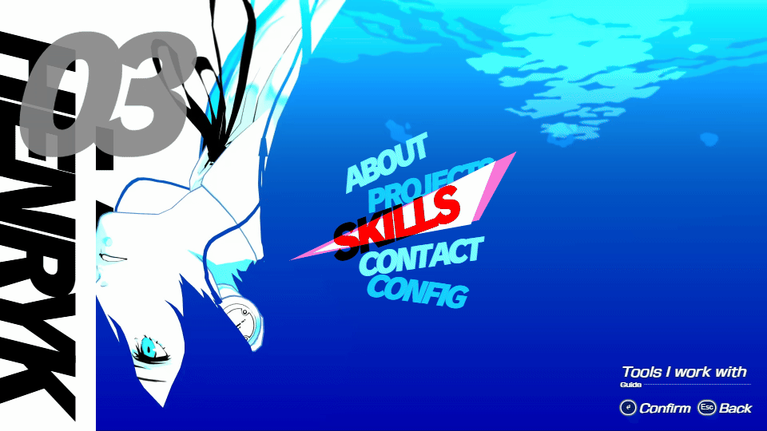

  

### about

16-year-old software engineer and founder of headcanon, a fictional-first marketplace and licensing platform. building full-stack web apps, ai agents, and developer tooling in typescript and python.

🌐 [portfolio](https://tacogod900.github.io) &nbsp;·&nbsp; ✉️ [henrykgreysson78@gmail.com](mailto:henrykgreysson78@gmail.com) &nbsp;·&nbsp; 📍 Melbourne

### core skills

  

- **languages:** typescript · javascript · python · c# · c · sql
- **web & apps:** React · Next.js · Node.js · REST APIs · Vite
- **backend & data:** Supabase · PostgreSQL · Stripe · GitHub API
- **ai & ml:** LLM agents · AI-powered apps · Jupyter · Kaggle
- **tools:** Git · GitHub Actions · Vercel · Claude Code

  
   
  ↑ my portfolio is a playable Persona 3 Reload-style menu · <a href="https://tacogod900.github.io">open it</a> · <a href="https://github.com/TacoGod900/tacogod900.github.io">source</a>

### projects

- **[headcanon](https://github.com/TacoGod900/headcanon-showcase)** — fictional-first marketplace and licensing platform I founded · React · Cloudflare Workers · D1 · [▶ watch the demo](https://www.loom.com/share/540d6dbd1be54ce28ee9439d2786e891)
- **[argus](https://github.com/TacoGod900/argus)** — an AI engineer that verifies code changes by actually running the app in a browser and returning PASS/FAIL with a root cause · TypeScript · Playwright · Claude Agent SDK
- **[customer-zero](https://github.com/TacoGod900/customer-zero)** — an AI customer that finds cross-system SaaS bugs with real Stripe, Supabase and GitHub evidence · TypeScript · [live](https://customer-zero-eta.vercel.app)
- **[orchard](https://github.com/TacoGod900/Orchard)** — experimental clean-room Windows dev platform: a SwiftUI-shaped subset lowered to JSON IR and rendered with .NET · C# · Swift · [extended mirror](https://github.com/TacoGod900/orchard-mirror)
- **[habitat](https://github.com/TacoGod900/habitat)** — scan a room, design in it, see it in AR at real scale · native iOS built from Windows via a macOS CI runner · Swift · ARKit
- **[aniryk](https://aniryk.vercel.app)** — anime streaming site · TypeScript
- **[portfolio](https://github.com/TacoGod900/tacogod900.github.io)** — the Persona 3 Reload-style menu above · SvelteKit · Three.js

### contribution graph

  

